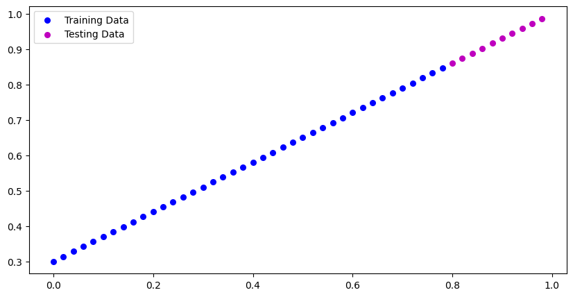
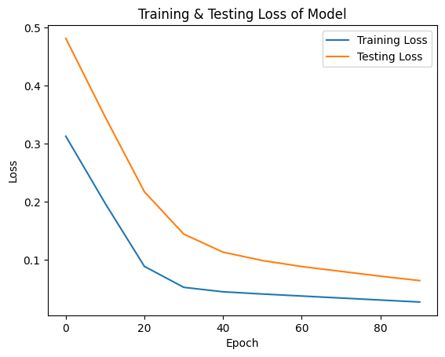
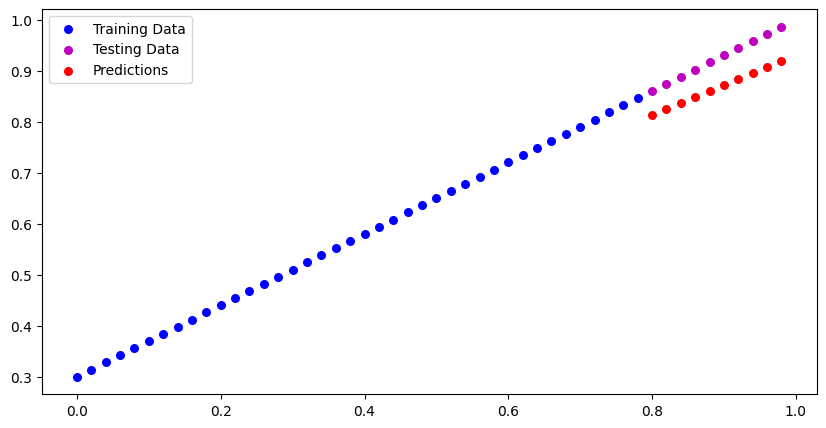

# PyTorch Workflow Fundamentals


## About the Project
This repository serves as a personal checkpoint in my deep learning journey, focusing on the core workflow of **PyTorch**. Rather than relying on high-level abstractions immediately, this project involves building a machine learning model from the ground up. It covers the end-to-end lifecycle: generating data, building a neural network architecture, writing custom training and testing loops, and finally, saving the trained model for future inference.

The core problem explored here is teaching a model to understand and predict patterns using **Linear Regression**.

###  Understanding Linear Regression
Imagine you are trying to guess the weight of a suitcase based solely on its size. After lifting a few bags (your *training data*), your brain figures out a mental rule of thumb: *"For every extra inch of size, the bag adds about 2 pounds, plus a base weight of 5 pounds for the empty case itself."* Linear regression does exactly this mathematically. It finds the best "rule of thumb" (a straight line) to predict an outcome based on given inputs, adjusting its parameters to minimize the difference between its guesses and reality. In mathematical terms, the model learns the optimal weights and biases for the equation:
$y = wx + b$

##  Key Concepts & Workflow

### 1. Data Preparation & Splitting
Machine learning requires data. For this project, I generated a known dataset using a linear formula and split it into training (80%) and testing (20%) sets. This is a critical industry practice to ensure the model learns from the training data but is evaluated on unseen test data to prevent overfitting.


*Visualizing the training data (what the model learns from) and testing data (what the model is evaluated on).*

### 2. Building the Model (`torch.nn`)
I utilized PyTorch's `nn.Module` to build a standard linear regression model. By subclassing `nn.Module`, I defined the model's parameters (`weights` and `bias`) and implemented the `forward()` method, which dictates the computational graph the data follows.

### 3. Training Loop & Optimization
A model doesn't learn on its own; it requires feedback. 
* **Loss Function:** I used Mean Absolute Error (`nn.L1Loss()`) to measure how wrong the model's predictions were compared to the actual data.
* **Optimizer:** I implemented Stochastic Gradient Descent (`torch.optim.SGD()`) to update the model's parameters and minimize the loss.
* **Backpropagation:** The training loop iteratively calculates the loss, performs backpropagation (`loss.backward()`), and adjusts weights (`optimizer.step()`).


*Tracking the reduction in training and testing loss over 100 epochs.*

### 4. Inference & Evaluation
To make predictions efficiently, I utilized the `torch.inference_mode()` context manager. This disables gradient tracking, making forward-passes faster and significantly reducing memory consumption during evaluation.


*Comparing the model's final predictions against the actual test data.*

### 5. Saving and Loading Models
To ensure the model can be deployed or reused, I implemented PyTorch's `torch.save` and `torch.load` utilities, specifically saving the `model.state_dict()` to efficiently serialize the learned parameters.

##  Tech Stack
* **Language:** Python
* **Deep Learning Framework:** PyTorch (`torch`, `torch.nn`, `torch.optim`)
* **Data Visualization:** Matplotlib

##  Getting Started (Installation)

To clone and run this project locally:

1. **Clone the repository:**
   ```bash
   git clone [https://github.com/YOUR_USERNAME/YOUR_REPO_NAME.git](https://github.com/YOUR_USERNAME/YOUR_REPO_NAME.git)
   cd YOUR_REPO_NAME
2. **Create a virtual environment:**
   `python -m venv venv
   source venv/bin/activate  # On Windows use venv\Scripts\activate`

3.  **Install dependencies:**
  `pip install torch matplotlib`
